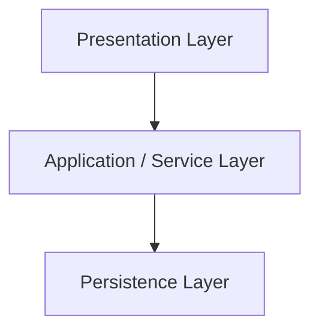
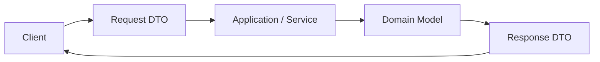
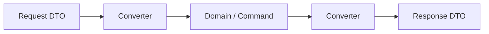

# 1. 아키텍처 구조란?
## 한 줄 정의

아키텍처 구조는 소프트웨어 시스템을 어떤 큰 구성요소로 나누고, 각 요소에 따른 책임을 두며, 그사이의 관계와 의존 방향을 어떻게 정할지에 대한 상위 수준의 설계다.

## 무엇인가

아키텍처 구조는 단순한 **코드배치 방식**이 아니라, 시스템을 이해하고 변경하기 쉬벡 만들기위한 구조적 관점이다.

즉, 기능을 구현하는 세부 코드보다 한 단계 위에서 **어떤 책임을 어디에 둘 것인가**, **어던 부분이 어떤 부분에 의존해도 되는가?** 등을 따지게 된다.

따라서 아키텍처 구조를 보거나 설계한다는 것은 아래의 예시와 같은 질문 혹은 설계 관점을 가진다는 것을 뜻한다.

- 요청을 받는 부분과 비즈니스 규칙을 처리하는 부부이 분리되어 있는가?
- 데이터 접근이 다른 계층으로 새어 나오지 않는가?
- 기능 변경시 수정 범위가 예측 가능한가?
- 이해하기 편한가?

> 즉, 아키텍처는 **예쁘게 폴더를 나누는일**보다 시스템의 이해 가능성, 변경 가능성, 유지 보수성을 좌우하는 구조적 결정에 더 가깝다.
>

## 왜 필요한가

가장 중요한 것은 유지보수시에 범위와 이해 비용이 중요하기 때문이다.

시스템이 커질수록, 혹은 AI가 작업을 많이 할수록 중요하다고 생각한다. 내가 설계를 느슨하게 했거나 설계 자체를 이해하지 못하고 있다고 생각해보자. 어떤 부분을 변경해야하는지, 지금 어떤 책임을 가진 부분인지 등에 대해서 인지하기 어려워진다고 생각한다.

이 부분에서 실무 관점에서 아키텍처는 내가 좋아하는 **템플릿** 혹은 약속의 역할을 한다고 생각한다!! AI시대에 이런

## 무엇과 구별해야 하는가

지금 우리가 정리하고 있는 아키텍처는 일명 "소프트웨어 아키텍처", "애플리케이션 아키텍처"라고 불린다. 이는 애플리케이션 내부를 어떻게 나눌지에 대한 구조를 설계한 내용이기 때문이다.

하지만 우리는 인프라 다이어그램, AWS 구성도, DB 연결 구조를 표현할 때에도 아키텍처라는 표현을 쓰는 것을 알 수 있는데 이때는 **시스템**아키텍처 관점에서 말한다

또한 "설계 패턴"과도 살짝은 성격이 다르다고 볼 수 있다. 패턴은 아키텍처보다 아래 수준의 더 반복적으로 쓰이는 방식이다.

## 예시

### 1. 계층형 아키텍처


- **장점**
    1. 프로젝트 전반적인 이해도가 낮아도, 패키지 구조만 보고 전체적인 구조를 파악할 수 있다.
        - 애플리케이션의 API를 보고 흐름을 파악하고 싶다면, Controller 패키지 하나만 보고 파악할 수 있다.
        - 애플리케이션의 비즈니스 로직을 보고 싶다면, Service 패키지 하나만 보고 파악할 수 있다.
    2. 계층별 응집도가 높아진다.
        - 계층별 수정이 일어날 때, 하나의 패키지만 보면 된다.
- **단점**
    1. 도메인별 응집도가 낮다. (패키지로 애플리케이션의 기능을 구분짓지 못한다)
        - 1-1. 도메인의 흐름을 파악하기 힘들다.
            - Product 도메인의 흐름을 보고 싶을 때, 모든 계층 패키지를 봐야한다.
            - 하나의 패키지안에 여러 도메인(상품, 장바구니, 사용자)들이 섞여 있다.
        - 1-2. 도메인과 관련된 스펙 & 기능이 변경되었을 때, 변경 범위가 크다.
            - Product에 대한 변경점이 있을 때, 여러 패키지에서 변경이 일어난다.=
    2. 유스케이스(사용자의 행위) 표현이 어렵다.
        - 규모가 커지면, 유스케이스별로 클래스를 분리할 때가 있다.
        - ex : 상품 등록 유스 케이스 -> RegisterProductService
        - 하지만, 계층형에서는 계층으로 패키지가 묶이기 때문에 위와 같이 네이밍해서 분리하기 어렵다.

### 2. 도메인형 아키텍처


- **장점**
    1. 도메인별 응집도가 높아진다.
        - 1-1. 도메인의 흐름을 파악하기 쉽다.
            - Product 도메인의 흐름을 보고 싶을 때, Product 패키지 하나만 보면 된다.
        - 1-2. 도메인과 관련된 스펙 & 기능이 변경되었을 때, 변경 범위가 적다.
            - Product에 대한 변경점이 있을 때, Product 패키지만 변경이 일어난다.
    2. 유스케이스별로 세분화해서 표현이 가능하다.
        - ex : 상품 등록 유스 케이스 -> RegisterProductService
        - ex : 상품 검색 유스 케이스 -> SearchProductService
        - 도메인별로 패키지가 나뉘기 때문에 product 패키지에서 위와 같은 네이밍으로 분리할 수 있다.
- **단점**
    - 애플리케이션의 전반적인 흐름을 한눈에 파악하기가 어렵다.
        - 흐름을 파악하기 위해 여러 패키지를 왔다갔다 해야할 가능성이 높다.
    - 개발자의 관점에 따라 어느 패키지에 둘지 애매한 클래스들이 존재한다.
        - Welcome 페이지를 맵핑하는 컨트롤러일 때, 어느 도메인 패키지에 위치할지 개발자에 따라 다를 수 있다.
        - 자신이 예상하는 패키지와 다를 때, 해당 클래스를 찾기가 어렵다.

## 실무에서는 왜 중요한가

AI가 발전할수록 구현 자체보다 설계와 구조를 판단하는 능력이 더 중요해진다.
AI는 동작하는 코드 초안을 빠르게 만들 수 있지만 책임 경계가 흐리거나 계층을 우회하는 등의 섞인 구조를 만들기 쉽다. 하지만, 결국에 실무에서는 코드가 돌아가는것보다는 모두의 이해를 위해 로직이 어디에 있어야하는가 변경이 생겼을때 어떻게 영향을 통제할 것인가 하는 아키텍처 수준의 판단이 더 중요해진다.

이때 아키텍처를 AI와 미리 깊게 설계하고 시작하는 것이 중요하다고 볼 수 있다.


# Swagger 란?

## OpenAPI

OpenAPI Specification(OAS)은 API의 엔드포인트, 요청 파라미터, 응답 형식, 인증 방식 등을 YAML 또는 JSON으로 기술하는 표준 명세이다.

핵심은 사람이 읽는 문서이면서 동시에 **기계가 읽을 수 있는 계약서**라는 점이다.

즉 OpenAPI는 다음을 표현하는 형식이다.

- 어떤 URL이 존재하는가
- 어떤 HTTP 메서드를 사용하는가
- 어떤 요청 데이터를 받는가
- 어떤 응답을 반환하는가
- 어떤 인증 방식을 사용하는가

정리하면 **OpenAPI는 API 명세의 표준**이다.

## Swagger

Swagger는 OpenAPI를 다루는 도구군이다.

대표적인 예는 다음과 같다.

- Swagger UI
- Swagger Editor
- Swagger Codegen

특히 많이 보는 것은 **Swagger UI**이다.

Swagger UI는 OpenAPI 명세를 읽어서 브라우저에서 API 문서를 시각화하고, 직접 요청을 보내보는 기능을 제공하는 도구이다.

정리하면 **Swagger UI는 OpenAPI 명세를 보여주는 화면**이다.

## 둘의 관계

과거에는 Swagger Specification이라는 이름이 사용되었고, 이후 OpenAPI Specification으로 표준화되었다.

즉 현재 기준으로는 다음 구분이 더 정확하다.

- **OpenAPI** = 표준 명세
- **Swagger** = 그 명세를 활용하는 도구 이름

## Spring에서의 사용 방식

Spring Boot에서는 보통 `springdoc-openapi`를 사용하여 컨트롤러 정보를 바탕으로 OpenAPI 문서를 생성하고, 그 위에 Swagger UI를 띄우는 방식이다.

흐름은 다음과 같다.

1. 컨트롤러 작성
2. OpenAPI 문서 생성
3. Swagger UI로 시각화 및 테스트

즉 Spring에서 Swagger를 사용한다는 말은, 보통 **OpenAPI 명세를 생성하고 그것을 Swagger UI로 확인한다는 뜻**이다.

## 왜 중요한가

OpenAPI는 단순 문서가 아니라 **기계가 읽을 수 있는 API 계약**이기 때문에 다음과 같은 활용이 가능하다.

- 문서 자동 생성
- 클라이언트 코드 생성
- 테스트 생성
- 설계 검증
- 도구 간 연동

즉 핵심은 **Swagger 화면 자체보다 OpenAPI 명세의 존재**이다!!

AI가 발전하며 점점 문서화에 시간을 더 쏟고 정리의 중요성이 높아지며 Openapi의 가치도 올라간다고 생각한다.

# 도메인형 아키텍처란?

## 무엇인가

사실 “도메인형 아키텍처”라는 표현은 어색하다고 생각한다. 만약 아래의 예시처럼 product, member 아래에 각각 컨트롤러, 서비스, dto, dao 를 두는 방식은 시스템 전체 아키텍처라기보다는 도메인 기준 패키지 구조 라고 부르는 편이 정확하다고 생각한다.

이것은 패키지 모듈별로 코드 조직을 분류한 방식에 대한 얘기라고 생각하지 이것만으로 도메인을 위주로한 비즈니스 규칙이라고 생각하지 않는다.

따라서 도메인이 비즈니스 규칙의 중심이 되고, 기술보다 도메인 모델이 핵심이 되는 더 넓은 관점에서 얘기한다면 그때는 도메인 중심 설계 혹은 DDD 지향 구조라고 부르는게 더 분명하다고 생각한다.

쉽게 말하면

```
product
 └ controller
 └ service
 └ dao
 └ dto

member
 └ controller
 └ service
 └ dao
 └ dto
```

위의 구조에서 보면 단순히 product, member 같은 기능/도메인 기준으로 묶인 형태를 보이는데 이는 우선적으로 당연히 코드관점에서의 배치 방식을 뜻한다.

다시 말해 이것은 파일과 패키지를 어떤 기준으로 정리할까에 대한 관점일 뿐이다.

더 나아가 아키텍처라고 한다면 [Software Architecture](https://www.notion.so/makeus-challenge/Software%20Architecture) 정리했었듯이 **시스템의 책임을 어떤 단위로 나누고, 의존 방향을 어떻게 잡고, 어떤 층이 어떤 층을 알 수 있게 할까?** 의 관점에서 볼 필요가 있다고 생각하기 때문이다.

### 왜 계층형은 “아키텍처”라는 말이 잘 어울리는가

계층형은 단순히 폴더를 이렇게 만든다는 뜻이 아니다.

controller/

service/

repository/

이건 계층형 아키텍처를 **패키지로 표현한 한 가지 모습**일 뿐이다.

계층형의 본질은 이런 구조 원리에 있어 중요한건 폴더를 나눈 폴더명이 아니라



- Presentation은 사용자/외부와 접점이다
- Service는 흐름/유스케이스를 처리한다
- Persistence는 저장을 담당한다
- 보통 위에서 아래로 호출한다
  등의 핵심 원리에 있다.

즉 계층형은 **책임 분리 원칙**, **의존 방향**, **시스템 구조 규칙**을 말한다.

그래서 “계층형 아키텍처”는 자연스러운 표현이다.

따라서 도메인이 조금더 설계 관점에서 가까워 지려면 도메인 중심 설계 관점이 들어가야한다.

- 비즈니스 규칙은 도메인에 가깝게 둔다
- 서비스는 흐름을 조정한다
- 인프라/DB는 바깥으로 밀린다
- 도메인 객체가 의미와 규칙을 가진다

위와 같은 예시를 볼 수 있다.

# DDD vs 도메인형 아키텍처

## 한 줄 정의

**DDD는 도메인을 중심으로 시스템을 모델링하는 더 큰 설계 접근이고, “도메인형 아키텍처”라고 불리는 것은 보통 그보다 좁은 구조적 표현 또는 패키지 조직 방식을 가리키는 경우가 많다.**

## DDD는 무엇인가

DDD는 **Domain-Driven Design**, 즉 **도메인 주도 설계**다. 핵심은 단순히 “도메인별로 폴더를 나누자”가 아니다.

DDD는 더 큰 범위의 질문을 다룬다. 예를 들면 이런 질문들이다.

- 이 시스템의 핵심 도메인은 무엇인가?
- 어떤 개념이 중요한가?
- 팀이 쓰는 용어와 코드의 용어가 일치하는가?
- 어디까지를 하나의 모델로 보고, 어디서 경계를 나눠야 하는가?
- 어떤 규칙을 어떤 객체가 책임져야 하는가?
- 도메인의 일관성을 어떤 단위로 유지할 것인가?

즉 DDD는 단순한 코드 정리법이 아니라, **비즈니스 문제를 소프트웨어 모델로 옮기는 설계 접근**이다.

---

## DDD의 범위

DDD는 보통 두 층위로 이해하는 게 좋다.

### 1. 전략적 설계

시스템을 더 큰 단위에서 어떻게 나눌 것인가를 다룬다.

예:

- Bounded Context
- Ubiquitous Language
- Context Map
- Subdomain

이건 “이 시스템 전체를 어떻게 분해하고 경계를 나눌까?”의 문제다.

---

### 2. 전술적 설계

코드 수준에서 도메인 모델을 어떻게 표현할 것인가를 다룬다.

예:

- Entity
- Value Object
- Aggregate
- Repository
- Domain Service
- Domain Event

이건 “도메인 규칙을 코드에 어떻게 담을까?”의 문제다.

---

즉 DDD는:

모델링

- 경계 설정
- 용어 통일
- 책임 배치
- 코드 구조

까지 포함하는 더 큰 개념이다.

---

## 그러면 도메인형 아키텍처는 무엇인가

**“도메인형 아키텍처”라는 말을 좁은 의미와 넓은 의미로 나눠서** 보는 게 좋댜. 위의 정리 처럼.

---

## 좁은 의미: 도메인 기준 패키지 구조

이 경우는 아키텍처라기보다 **코드를 묶는 방식**에 가깝다.

예를 들면:

```sql
domain/  
 ├─ member/  
 ├─ mission/  
 └─ review/
```

혹은

```sql
member/
├─ controller

├─ service

├─ entity

├─ dto
```

이 구조의 장점은 관련 코드가 도메인별로 모여서

응집도가 높아지고 변경 범위를 좁히기 쉽다는 점이다.

하지만 이건 아직 **도메인 중심 설계가 되었다는 보장**은 아니다.

왜냐하면 규칙이 여전히 전부 service 안에 있을 수도 있기 때문이다.

즉 이건 더 정확히 말하면:

- 도메인 기준 패키지 구조
- package by feature
- package by domain

에 가깝다.

## DDD와 무엇이 다른가

### DDD

- 더 넓다
- 패키지 구조보다 크다
- 모델링, 경계, 언어, 책임 배치까지 포함한다

### 도메인형 아키텍처

- 보통 더 좁다
- 주로 구조/패키지/책임 배치 쪽에 초점이 있다
- 특히 실무에서는 “도메인별 패키징”이나 “도메인 중심 구조”를 가리키는 경우가 많다

즉 둘의 관계를 가장 단순하게 표현하면 이렇다.

DDD > 도메인 중심 설계/구조 > 도메인 기준 패키지 구조

---

## 직접적으로 다가올때?

### “우리 도메인형으로 짜자”

이 말은 대개 두 가지 중 하나다.

1. 도메인별 패키지로 나누자
2. 서비스에 다 넣지 말고 도메인에 규칙을 두자

즉 보통은 좁은 의미다.

---

### “우리 DDD를 도입하자”

이건 더 큰 의미일 가능성이 크다.

- 팀 언어 정리
- 경계 분리
- 모델 재정의
- Aggregate 설계
- Context 분리

즉 단순한 패키지 구조 변경보다 훨씬 넓은 범위를 건드릴 수 있다.

# 왜 DTO를 사용하는가?

## 한 줄 정의

DTO(Data Transfer Obejct)는 계층이나 시스템 경계를 넘어서 데이터를 전달하기 위한 객체다.

## 무엇인가

DTO는 도메인 모델 그 자체라기보다는 데이터를 안전하고 목적에 맞게 옮기기 위한 운반 객체라고 생각하면 편하다.

## 왜 필요한가

### 도메인 객체를 외부에 직접 노출하지 않기 위해

도메인 엔티티를 API 응답으로 바로 내보내면 문제가 생길 수 있다.

예를들어 Member 엔티티에:

- password
- internalStatus

등의 정보가 있다면 정보가 노출될 수 있기에 DTO는 **노출 범위**를 통제한다고 할 수 있다.

### API 스펙과 내부 모델을 분리하기 위해

외부 API 형식은 자주 바뀔 수 있고, 내부 도메인 모델도 따로 변경이 될 때가 있다.

따라서 DTO를 둠으로써 외부와 소통하는 애와 내부에서 사용되는 모델을 따로 분리가 가능하게 된다.

### 요청/응답 목적에 맞는 모양을 만들기 위해

도메인 엔티티 하나가 화면 하나에 필요한 형식과 정확히 맞아 떨어지는 경우는 드물다.

DTO는 조회/응답 목적에 맞는 형태를 만들기에 용이하다!

## 코드에서는 어떻게 보이는가



이렇게 경계 앞뒤에서 모양을 바꾸는 역할인 느낌이다.

# 컨버터는 왜 사용하는가?

## 한 줄 정의

컨버터는 한 객체 표현을 다른 객체 표현으로 변환하는 책임을 분리한 구성 요소이다.

## 무엇인가

컨버터는 보통 다음 변환을 담당한다.

- Request DTO → Domain/Command
- Domain Entity → Response DTO
- External API Response → 내부 모델
- Persistence Entity ↔ Domain Model

즉 컨버터는 **서로 다른 계층/경계의 객체 모양을 바꾸는 역할**을 맡는다.

## 왜 필요한가

### 1. 변환 책임을 한 곳에 모으기 위해

### 2. 계층 경계를 더 명확히 하기 위해

### 3. 테스트와 유지보수를 쉽게 하기 위해

## 코드/ 구조에서는 어떻게 보이는가



즉 컨버터는 보통은 계층 사이의 번역기라고 생각하면 편하다.

```java
public class ProductConverter {

    public static Product toEntity(CreateProductRequest request) {
        return new Product(request.name(), request.price());
    }

    public static ProductResponse toResponse(Product product) {
        return new ProductResponse(
            product.getId(),
            product.getName(),
            product.getPrice()
        );
    }
}
```

혹은 command 객체를 사용하여 중간에서 바꾸는 구조도 사용이 된다.

```java

public record CreateProductCommand(String name, int price) {}

// ---

public class ProductConverter {
    public static CreateProductCommand toCommand(CreateProductRequest request) {
        return new CreateProductCommand(request.name(), request.price());
    }
}
```

위의 방식은 Controller과 Domain을 직접 알지 않아서 더 깔끔하다.

## 실무에서는 왜 중요한가

## 흔한 오해

### 오해 1. 컨버터는 무조건 따로 클래스로 분리해야 한다

아니다.

변환이 매우 단순하면 정적 팩토리나 DTO/응답 객체 내부 메서드로도 충분할 수 있다.

### 오해 2. 컨버터는 단순 반복이라 의미가 없다

아니다.

변환은 계층 경계와 결합도에 직접 영향을 준다.

### 오해 3. 모든 변환을 한 컨버터에 몰아넣어도 된다

아니다.

`CommonConverter` 같은 거대한 유틸은 오히려 책임이 흐려진다.

보통 도메인/기능별로 나누는 편이 낫다.

## 예시

결국에 컨버터는 DTO와 같이 등장하는 경우가 많은데,

- DTO: 경계에서 쓰는 데이터 형식
- 컨버터: 그 형식을 다른 형식으로 바꾸는 도구